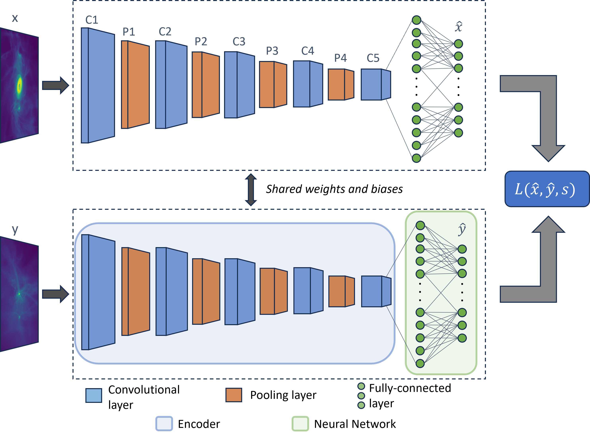

# Image similarity pipeline with the use of Siamese Neural Networks. 
This collection of scripts is the backbone for a pipeline for identifying similar images using a Siamese Neural Network.

The pipeline aims to analyze and extract significant features from images of protostellar system. Its objective is to identify images within a vast dataset of simulated images that closely resemble a specified observational image. Subsequently, it maps the distributions of system parameters related to these identified ”best matches”.

The purpose of implementing machine learning methods to this project is to create a method of matching simulated to observational images, that surpasses manual visual assessment in terms of precision and time. Given that the simulated images provide prior knowledge of system properties such as disk size, mass, and accretion rate, this has potential for creating a pipeline for quicker analysis of observed protostellar systems, when combined with the image matching. In this thesis, we utilize
a Siamese Neural Network model structure to map the similarity of pairs of images. The idea is to train the model to find the images from a large set of simulated snapshots of protostellar systems, that are most similar to a given target observational image. From the set of most similar images, we can
then provide distributions of the system properties, which can potentially provide novel insights to observations of protostellar systems.

Given that we do not have access to categorized data of protostellar systems, we instead provide each pair of training images with a measure of similarity computed from the system properties for each image. This is categorized as Weakly Supervised Metric Learning (WSML). The goal of this part of the thesis is thus to create the backbone of such a pipeline and to investigate 1: if the method can correctly identify similar images of protostellar systems based on WSML, and 2: whether the
distribution of system properties collected from the most similar images can provide any insight to the properties of the target observed protostellar system.

The pipeline we propose include the following steps:
1. Encoding the images to a latent image of lower dimensions, where each pixel is a representation
of features in the original image. This will provide the similarity-measuring model with a better
interpretation of the input image.
2. Measure similarities between one observed image and a large set of simulated images using a
trained Siamese network. The network takes as input pairs of images and outputs a value of the
similarity.
3. Find the simulated images that are most similar to the observed image and compute distributions
of their properties such as disk size, mass, and accretion rate.

The end result of the pipeline is first and foremost a mapped set of simulated protostellar systems that
is of high similarity with a given observed protostellar system. Second, the best-match distributions of
system properties can provide insight to further analysis of specific protostellar system.
This section will discuss the basic components of a Siamese Neural Network and how we can train
a model of such structure to find similar images. Our setup and implementation of such a model is
further discussed under methods.

# The pipeline

1. Setting up PyTorch DataLoaders with pairs of images using data_setup.py. For each pair is computed the ground truth similarity from the metadata of each image.
2. Build the various models with model_builder.py
3. Setting up main training and validation loops with engine.py
4. Setting up hyperparameter tuning with tuning.py
5. Train the model with train.py
6. Use the trained model to find best matches between datasets and a target image using matching.py

# The general model structure
The Siamese Neural Network implements a similarity learning by utilizing the image analysis and representation abilities of a Convolutional Neural Network. It outputs complex, compressed representations for two images simultanously, giving rise to the ability of learning to represent similar images with similar representations and vice versa. 

