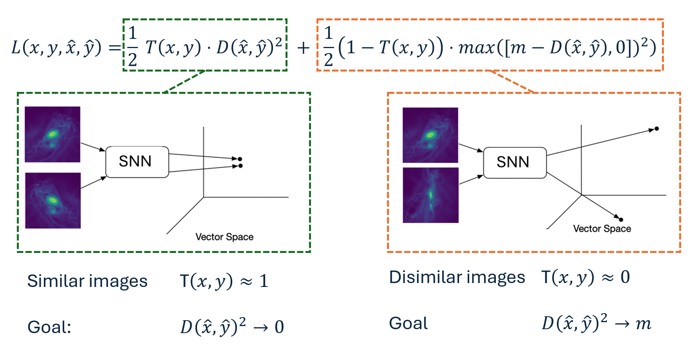
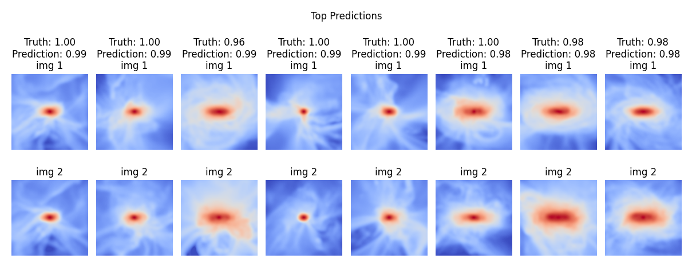
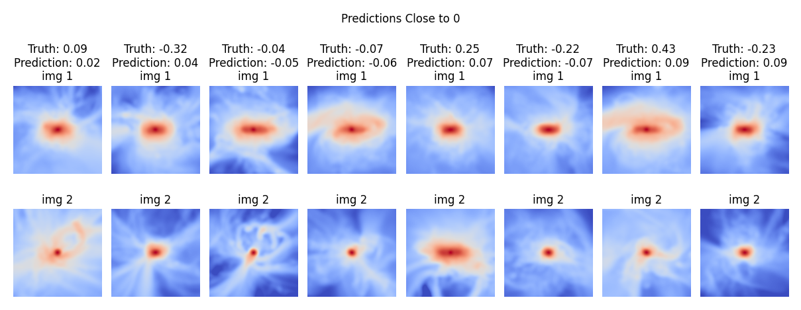
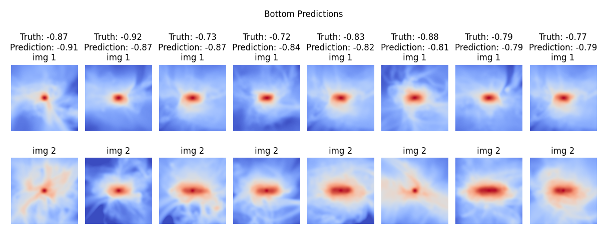

# Image similarity pipeline with the use of Siamese Neural Networks. 
This work is the backbone for a pipeline for identifying similar images using a Siamese Neural Network (SNN) - a complex deep neural network that is specialized to identify and map out features of images in order to learn to find similar images.

The pipeline aims to analyze and extract significant features from images of protostellar systems (young stars and their surroundings). Its objective is to identify images within a vast dataset of simulated images that closely resemble a specified observational image. These are termed "best matches". Subsequently, it maps the distributions of system parameters, such as the mass of the star or the age of the system, for these best matches. These distributions could serve as a guide or an estimation of the physical parameters (mass, age, ...) of the observed system. 

Given that there does not yet exist categorized data of protostellar systems, we instead provide each pair of training images with a measure of similarity computed from the system properties for each image. This is categorized as Weakly Supervised Metric Learning (WSML). The goal is thus to create the backbone of such a pipeline and to investigate 1: if the method can correctly identify similar images of protostellar systems based on WSML, and 2: whether the distribution of system properties collected from the most similar images can provide any insight to the properties of the target observed protostellar system.

The pipeline we propose include the following steps:
1. Encode the images down to a latent one-dimensional representation, where each component is a representation of features in the original image. This will provide the similarity-measuring model with a better interpretation of the input image.
2. Train a Siamese Neural Network on a training set of simulated images, where each pair of images are labeled by the similarity of the system parameters defined in the simulation.
3. Measure similarities between one observed image and a large set of simulated images using the trained Siamese network. 
4. Find the simulated images that are most similar to the observed image and compute distributions of their properties such as disk size, mass, and accretion rate.

The end result of the pipeline is first and foremost a mapped set of simulated protostellar systems that is of high similarity with a given observed protostellar system. Second, the best-match distributions of system properties could provide insight to further analysis of specific protostellar system.

# The pipeline

1. Setting up PyTorch DataLoaders with pairs of images using [data_setup.py](data_setup.py). For each pair, the ground truth similarity is computed from the cosine similarity of the sets of metadata from each image.
2. Build the various SNN models with [model_builder.py](model_builder.py)
3. Setting up main training and validation loops with [engine.py](engine.py)
4. Setting up hyperparameter tuning with [tuning.py](tuning.py)
5. Train the model with [train.py](train.py)
6. Use the trained model to find best matches between datasets and a target image using [matching.py](matching.py)

# The general model structure
The Siamese Neural Network implements a similarity learning by utilizing the image analysis and representation abilities of a Convolutional Neural Network. It outputs complex, compressed representations for two images simultanously, giving rise to the ability of learning to represent similar images with similar representations and vice versa. 

  
   
  <i>The architecture of our Siamese network model. Two images are processed through two identical branches of a CNN structure that consists of an encoder and a neural network. The distance between output representations $\hat{x}$ and $\hat{y}$ are compared to a ground truth similarity score $s$, to produce the loss.</i>

# Learning with a contrastive loss function
The model is trained using a contrastive loss function $L_{c}$ of the form:

$$
L_{c} = \frac{1}{2} T(x,y) D(\hat{x}, \hat{y})^2 + \frac{1}{2} (1-T(x,y))\cdot max\left([m-D(\hat{x}, \hat{y}), 0]\right)^2
$$

where $T(x,y)$ denotes the target similarity, $D(\hat{x}, \hat{y})$ denotes the distance between the output latent representations $\hat{x}$ and $\hat{y}$, and $m$ is the tunable margin that clarifies the desired maximum distance for dissimilar pairs. The goal of the contrastive loss function is to drive the distance of similar images, where $T\approx 1$, towards zero, while pushing the distance of dissimilar images, where $(1-T)\approx 1$, towards the margin. 

  

# Results
The following images are an example of the trained model's capabilities of identfying similar, non-similar and dissimilar pairs of images. The model identifies abstract structures within the images and creates compressed, one-dimensional representations of its findings. These results show that the model is able to accurately map these representations as similar for the image pairs that are truly similar, and vice versa, based on the physical properties of the systems within the images.

  

  

  
   
  <i>Representations of (top) the 8 most similar images according to the predicted outputs, (middle) 8 non-similar images, and (bottom) the 8 most dissimilar images according to predicted similarities. In most cases the prediction is very close to the actual similarity, showing that the model is able to correctly identify images.</i>

### More info
Are you interested in learning more about this model? Feel free to contact me by mail to anton14mol at gmail.com.
